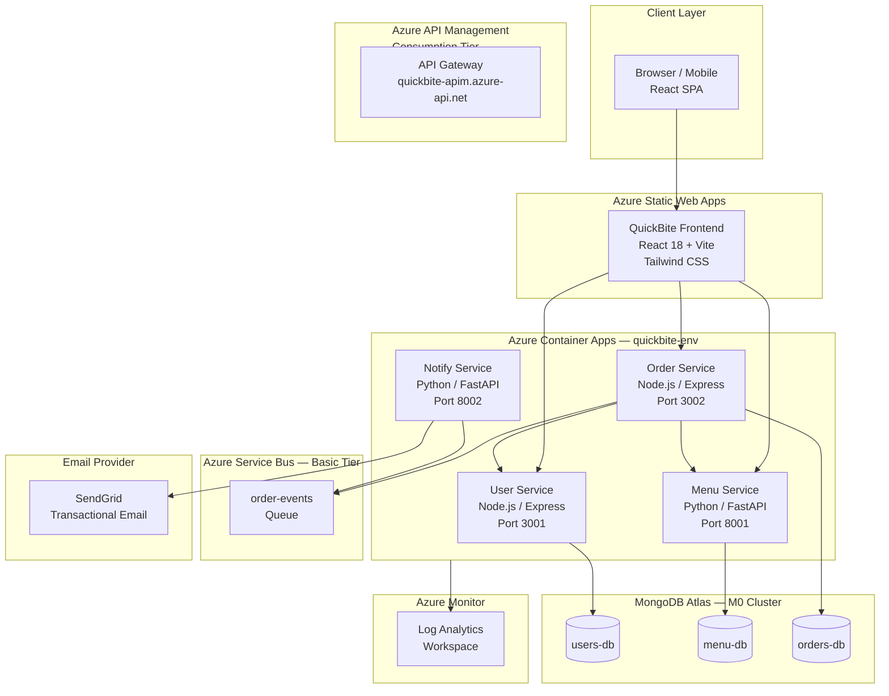
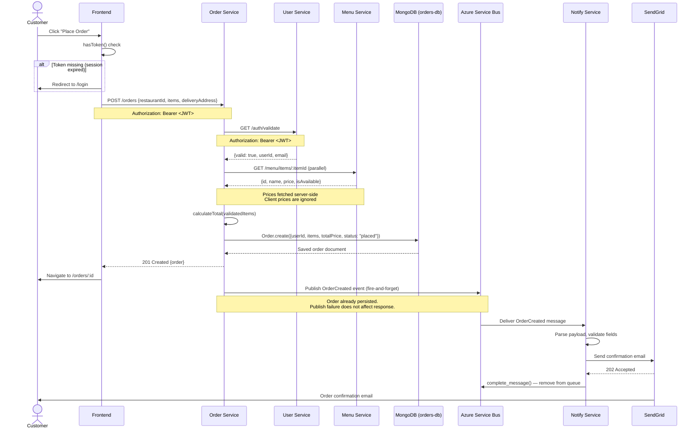
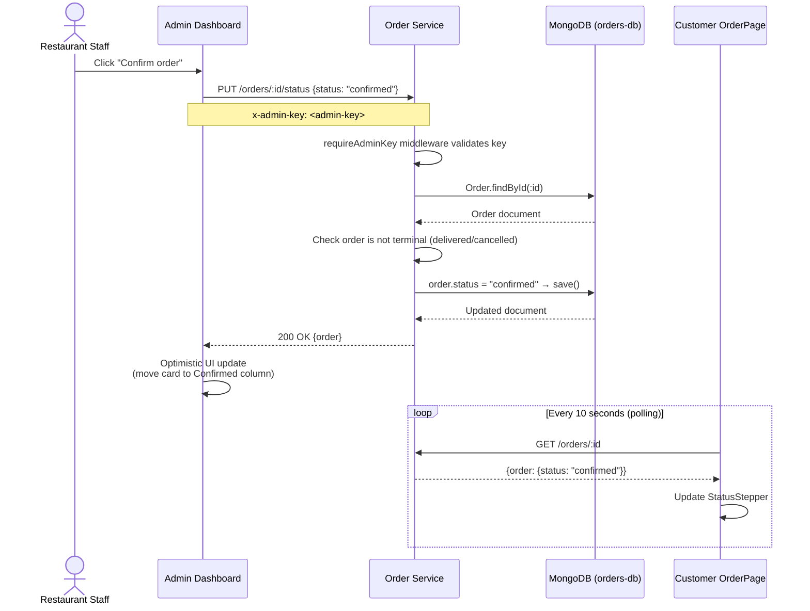
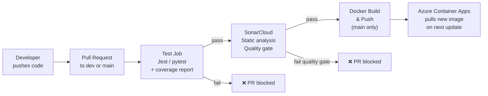
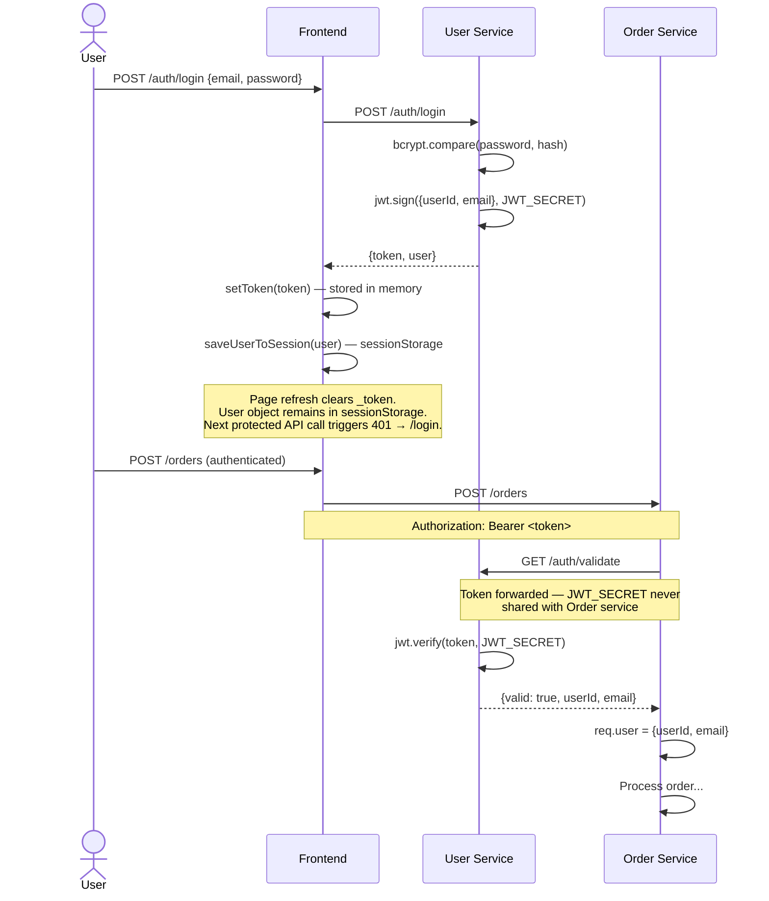

# QuickBite — Architecture Diagrams

## System Architecture

```mermaid
graph TB
    subgraph Client["Client Layer"]
        Browser["Browser / Mobile\nReact SPA"]
    end

    subgraph Azure_SWA["Azure Static Web Apps"]
        Frontend["QuickBite Frontend\nReact 18 + Vite\nTailwind CSS"]
    end

    subgraph Azure_APIM["Azure API Management\nConsumption Tier"]
        APIM["API Gateway\nquickbite-apim.azure-api.net"]
    end

    subgraph Azure_ACA["Azure Container Apps — quickbite-env"]
        UserSvc["User Service\nNode.js / Express\nPort 3001"]
        MenuSvc["Menu Service\nPython / FastAPI\nPort 8001"]
        OrderSvc["Order Service\nNode.js / Express\nPort 3002"]
        NotifySvc["Notify Service\nPython / FastAPI\nPort 8002"]
    end

    subgraph MongoDB["MongoDB Atlas — M0 Cluster"]
        UsersDB[("users-db")]
        MenuDB[("menu-db")]
        OrdersDB[("orders-db")]
    end

    subgraph Azure_Messaging["Azure Service Bus — Basic Tier"]
        SBQueue["order-events\nQueue"]
    end

    subgraph Email["Email Provider"]
        SendGrid["SendGrid\nTransactional Email"]
    end

    subgraph Monitoring["Azure Monitor"]
        LogAnalytics["Log Analytics\nWorkspace"]
    end

    Browser --> Frontend
    Frontend --> UserSvc
    Frontend --> MenuSvc
    Frontend --> OrderSvc

    UserSvc --> UsersDB
    MenuSvc --> MenuDB
    OrderSvc --> OrdersDB
    OrderSvc --> UserSvc
    OrderSvc --> MenuSvc
    OrderSvc --> SBQueue
    NotifySvc --> SBQueue
    NotifySvc --> SendGrid

    Azure_ACA --> LogAnalytics
```

---

## Order Placement Sequence

```mermaid
sequenceDiagram
    actor Customer
    participant FE as Frontend
    participant OS as Order Service
    participant US as User Service
    participant MS as Menu Service
    participant DB as MongoDB (orders-db)
    participant SB as Azure Service Bus
    participant NS as Notify Service
    participant SG as SendGrid

    Customer->>FE: Click "Place Order"
    FE->>FE: hasToken() check
    alt Token missing (session expired)
        FE->>Customer: Redirect to /login
    end

    FE->>OS: POST /orders {restaurantId, items, deliveryAddress}
    Note over FE,OS: Authorization: Bearer <JWT>

    OS->>US: GET /auth/validate
    Note over OS,US: Authorization: Bearer <JWT>
    US-->>OS: {valid: true, userId, email}

    OS->>MS: GET /menu/items/:itemId (parallel)
    MS-->>OS: {id, name, price, isAvailable}
    Note over OS,MS: Prices fetched server-side<br/>Client prices are ignored

    OS->>OS: calculateTotal(validatedItems)
    OS->>DB: Order.create({userId, items, totalPrice, status: "placed"})
    DB-->>OS: Saved order document

    OS-->>FE: 201 Created {order}
    FE->>Customer: Navigate to /orders/:id

    OS->>SB: Publish OrderCreated event (fire-and-forget)
    Note over OS,SB: Order already persisted.<br/>Publish failure does not affect response.

    SB->>NS: Deliver OrderCreated message
    NS->>NS: Parse payload, validate fields
    NS->>SG: Send confirmation email
    SG-->>NS: 202 Accepted
    NS->>SB: complete_message() — remove from queue
    SG->>Customer: Order confirmation email
```

---

## Admin Order Status Update Sequence

```mermaid
sequenceDiagram
    actor Staff as Restaurant Staff
    participant AdminUI as Admin Dashboard
    participant OS as Order Service
    participant DB as MongoDB (orders-db)
    participant CustomerUI as Customer OrderPage

    Staff->>AdminUI: Click "Confirm order"
    AdminUI->>OS: PUT /orders/:id/status {status: "confirmed"}
    Note over AdminUI,OS: x-admin-key: <admin-key>

    OS->>OS: requireAdminKey middleware validates key
    OS->>DB: Order.findById(:id)
    DB-->>OS: Order document

    OS->>OS: Check order is not terminal (delivered/cancelled)
    OS->>DB: order.status = "confirmed" → save()
    DB-->>OS: Updated document

    OS-->>AdminUI: 200 OK {order}
    AdminUI->>AdminUI: Optimistic UI update<br/>(move card to Confirmed column)

    loop Every 10 seconds (polling)
        CustomerUI->>OS: GET /orders/:id
        OS-->>CustomerUI: {order: {status: "confirmed"}}
        CustomerUI->>CustomerUI: Update StatusStepper
    end
```

---

## CI/CD Pipeline

```mermaid
flowchart LR
    Dev["Developer\npushes code"]
    PR["Pull Request\nto dev or main"]
    Test["Test Job\nJest / pytest\n+ coverage report"]
    Sonar["SonarCloud\nStatic analysis\nQuality gate"]
    Docker["Docker Build\n& Push\n(main only)"]
    Azure["Azure Container Apps\npulls new image\non next update"]

    Dev --> PR
    PR --> Test
    Test -->|pass| Sonar
    Test -->|fail| X1["❌ PR blocked"]
    Sonar -->|pass| Docker
    Sonar -->|fail quality gate| X2["❌ PR blocked"]
    Docker --> Azure
```

---

## Authentication Flow

```mermaid
sequenceDiagram
    actor User
    participant FE as Frontend
    participant US as User Service
    participant OS as Order Service

    User->>FE: POST /auth/login {email, password}
    FE->>US: POST /auth/login
    US->>US: bcrypt.compare(password, hash)
    US->>US: jwt.sign({userId, email}, JWT_SECRET)
    US-->>FE: {token, user}
    FE->>FE: setToken(token) — stored in memory
    FE->>FE: saveUserToSession(user) — sessionStorage

    Note over FE: Page refresh clears _token.<br/>User object remains in sessionStorage.<br/>Next protected API call triggers 401 → /login.

    User->>FE: POST /orders (authenticated)
    FE->>OS: POST /orders
    Note over FE,OS: Authorization: Bearer <token>
    OS->>US: GET /auth/validate
    Note over OS,US: Token forwarded — JWT_SECRET never<br/>shared with Order service
    US->>US: jwt.verify(token, JWT_SECRET)
    US-->>OS: {valid: true, userId, email}
    OS->>OS: req.user = {userId, email}
    OS->>OS: Process order...
```
